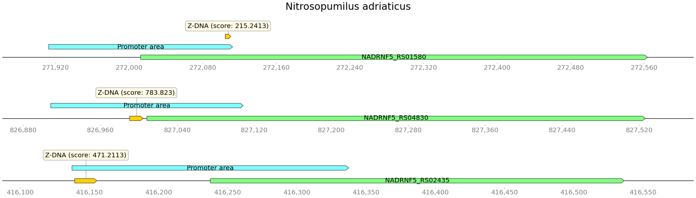
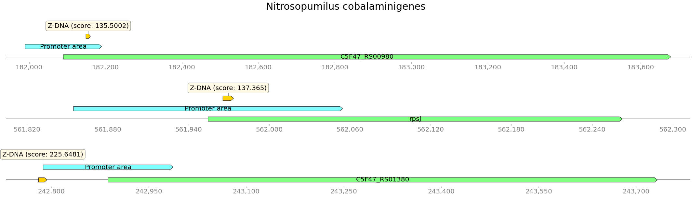
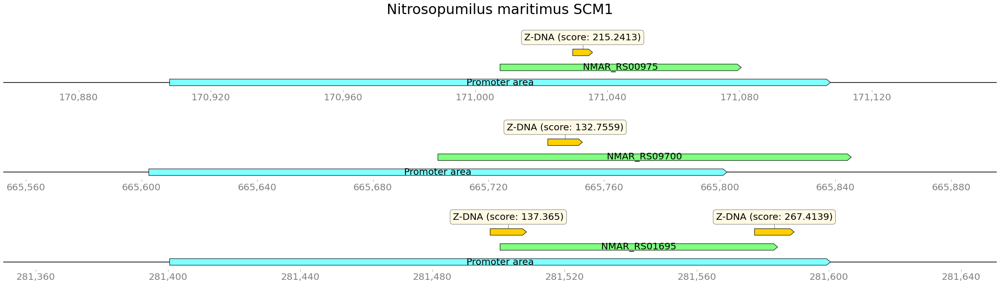
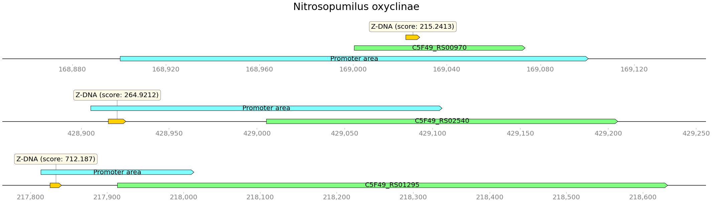
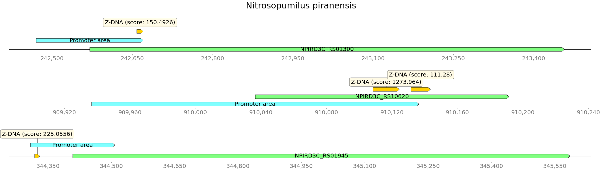
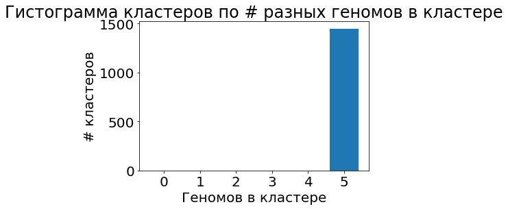

# HSE minor bioinf project 2022

[Colab](https://colab.research.google.com/drive/1m391t_fbMH2fYvIQoTmK5WLOfU7m9yMi?usp=sharing)

---

**Анализ аннотированных генов**

Organism                       | Genome length | Annotated genes | Coverage    
-------------------------------|---------------|-----------------|------------
Nitrosopumilus adriaticus      |       1803090 |            2197 | 0.89592
Nitrosopumilus cobalaminigenes |       1563356 |            1916 | 0.90715
Nitrosopumilus maritimus SCM1  |       1645259 |            1955 | 0.92018
Nitrosopumilus oxyclinae       |       1585110 |            1899 | 0.90716
Nitrosopumilus piranensis      |       1713078 |            2131 | 0.89619

**z-score >= 100** (взял 100, потому что иначе не выходило выделить кластера)

| Organism                       | Z-DNA regs count  | Z-DNA summ length 
---------------------------------|-------------------|-----------------
| Nitrosopumilus adriaticus      |           2128    |        21152
| Nitrosopumilus cobalaminigenes |           1473    |        15006
| Nitrosopumilus maritimus SCM1  |           2025    |        20378
| Nitrosopumilus oxyclinae       |           1664    |        16672
| Nitrosopumilus piranensis      |           2130    |        21196

**Intersectons with promoters**      
Nitrosopumilus adriaticus: 117       
Nitrosopumilus cobalaminigenes: 86       
Nitrosopumilus maritimus SCM1: 120       
Nitrosopumilus oxyclinae: 90       
Nitrosopumilus piranensis: 115       

С промотерами пересекается 10-20% участков Z-DNA

**Визуализация пересечений:**

**Гистограммы значений z-score для выбранных геномов**

Z-ДНК и гомологичные гены
Информация по полученным гомологичным кластерам
Всего кластеров: 1417

