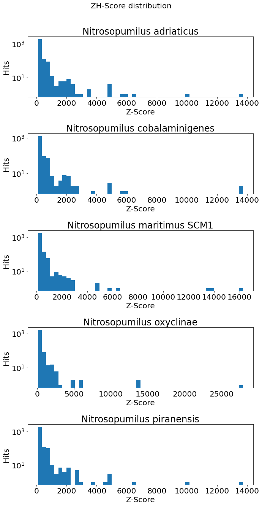

# HSE minor bioinf project 2022

[Colab](https://colab.research.google.com/drive/1m391t_fbMH2fYvIQoTmK5WLOfU7m9yMi?usp=sharing)

---

## Z-DNA и аннотированные гены

### Анализ аннотированных генов

Organism                       | Genome length | Annotated genes | Coverage    
-------------------------------|---------------|-----------------|------------
Nitrosopumilus adriaticus      |       1803090 |            2197 | 0.89592
Nitrosopumilus cobalaminigenes |       1563356 |            1916 | 0.90715
Nitrosopumilus maritimus SCM1  |       1645259 |            1955 | 0.92018
Nitrosopumilus oxyclinae       |       1585110 |            1899 | 0.90716
Nitrosopumilus piranensis      |       1713078 |            2131 | 0.89619

### z-score >= 100** 
**(взял 100, потому что иначе не выходило выделить кластера)**

| Organism                       | Z-DNA regs count  | Z-DNA summ length 
---------------------------------|-------------------|-----------------
| Nitrosopumilus adriaticus      |           2128    |        21152
| Nitrosopumilus cobalaminigenes |           1473    |        15006
| Nitrosopumilus maritimus SCM1  |           2025    |        20378
| Nitrosopumilus oxyclinae       |           1664    |        16672
| Nitrosopumilus piranensis      |           2130    |        21196

**Intersectons with promoters**      
Nitrosopumilus adriaticus: 117       
Nitrosopumilus cobalaminigenes: 86       
Nitrosopumilus maritimus SCM1: 120       
Nitrosopumilus oxyclinae: 90       
Nitrosopumilus piranensis: 115       

С промотерами пересекается 10-20% участков Z-DNA

### Визуализация пересечений:

### Гистограммы значений z-score для выбранных геномов

## Информация по полученным гомологичным кластерам
### Z-ДНК и гомологичные гены
Информация по полученным гомологичным кластерам
Всего кластеров: 1417

### Выбранные кластеры

### Множественное белковое выравнивание для каждого выбранного кластера:
result: https://github.com/aleph0naught/minor_bioinf_project/tree/master/alignment

**1 кластер:**
- WP_012214576.1 aspartokinase [Nitrosopumilus maritimus]
MTKLVVAKFGGSAIGPNGVSIPEIIQRITNLKQDSKVIAVFSAPLTLDNGKKRSLTDVMLEQGRNAENGVTPSLDIIKST
YEKILELVDDENKGKCENVIEQNLEKAKKALDEAFESKEFVDEVRSRALAFSGEILMSHVMNYILRSNKIKAETVDFEDW
PIITDNNIESTNFLTSESRTKMDKTAELVEQNEVVTIGGFIGKTVDNVTTTYERGGSDRTAADLGILFHKSYETSIDFEK
DSAVVSADPKIVESGLREVHQLSYNEARLAGMFGMKILDPIAIKEIVENGVDMPITVTNMKNPDKITTIKRILDEQKGHP
IKIVTGKENCAIFRIETNSIQKLLTSLDKDKRYSEFVILSPFTKDGIEFSRILFLDGDYVKRNEKYLLGFDSLATITYNR
GVITLIGDEMWRVQQVASRTSAKIGEAGLNILNMDAQEETSRIIIVVEDTKDNIRKAISAIHQEISEINFI
- WP_179361074.1 aspartate kinase [Nitrosopumilus cobalaminigenes]
MTKLIVAKFGGSALGPNGETIPKIIQRISDLKTDCKVITVFSAPLTIHNEKKRSLTDVILEQGKNAENGIKPSLDVVKST
YQKILEFVDENNKENCKKTIDYHLEKAQSALDTAYNNKEFINEVRSQALAFSGEILMSHVMNHILRSNGIKTEAVEYDDW
PIITDHNIEFTNFLTAESREKMGKIVELVDNNEVVTIGGFIGKTVDGITTTYERGGSDRTAADLGILFHKKYETNIDFEK
DSSVVSADPKIVDSDLREIIQLSYNEARLAGMFGMKILDPIAIKEIVENGVDMPITITNMKNPEKITTIKRNLDEQKGHP
IKIVTGKENCAIFRIETSAIQKLLTSLEKDKHYSEFIILSPFTKDGIEFSRILFLDGEYVKRNEKYLLGFDSLATITYNR
GVITLIGDEMWRVQQVASRTSAKIGESGLNILNMDAQEETSRIIIVVEDTQDNITKAIRAIHQEISKINFI
- WP_179362914.1 aspartate kinase [Nitrosopumilus oxyclinae]
MTKLIVAKFGGSALGPNGEFIAKIIQRVDKLKTDSKVIAVFSAPLTIYNEKKRSLTDVVLEQGRNAEKGEKPSLDIVKST
YQKILEKVDENNKENCIKTIDYHLEKAQSALDEAYKNKEFANEVRSKALAFSGEILMSHVMNHILRSNNIKSEAVKFDDW
PIITDKNIEFTNFLAAESRERMNKTVDLVENNEVVTIGGFIGKTVDNITTTYERGGSDRTAADLGILFHKKYETSIDFEK
DSSVVSADPKIVDSDLREITQLSYNEARLAGMFGMKILDPIAIKEIVENGVDIPITITNMKVPEKITTIKRNLEEQKGHP
IKIVTGKENCAIFRIETSAIQKLLTSLEKDKHYSEFVILSPFTKDGIEFSRILFLDGEYVKRNEKYLLAFDSLATITFNR
GVITLIGDEMWRVQQVASRTSAKIGESGLNILNMDAQEETSRIIIVVEDTHDNIAKAIKAIHQEISNINFE
- WP_048118208.1 aspartate kinase [Nitrosopumilus adriaticus]
MTKLVVAKFGGSAIGPNGESIPKIIQRINNLKKESKVIAVFSAPLTIHNGKKRSLTDVILEQGENAQNGITPSLDIVAST
YQKILEMINSENIENCKKILNLNLEKAQKALDEAFGNKEFVDETRSRALAFSGEILMSHMMNYILKSNGVKSDSVDFDDW
PIITDNNIESTNFLASKSRENIDKISQLVDENEVVTIGGFIGKTIDDVLTTYERGGSDRTAADLGILFHKKYETSIDFEK
DSAVVSADPKIVETNLREVSQLSYNEARLAGMFGMKILDPIAIKEIVENGVDLPITITNMKNPEKITTIKRILDEQKGHP
IKIVTGKENCAIFRIETSSIQKLLISLEKDKRYSEFVILSPFTKDGIEFSRILFLDGDYVKRNEKYLLGFDSLATITYNR
GVITLIGDEMWRVQQVASRTSAKIGDAGLNILNMDAQEETSRIIIVVEDAGDNIKNAIKAIHQEISNINFI
- WP_148702725.1 aspartate kinase [Nitrosopumilus piranensis]
MTKLVVSKFGGSAIGPDGEYIPKIIQRIVDLKKDSKVIAVFSAPLTMDNGKKRSLTDVILEQGRNAANGTTPSLEIIRTT
YQKILELVNSENKEKCKDVINLNLKKAQKALDEALESKEFVDEVRSCALAFSGEILMSHVMNYILRSNGINAETVDFEDW
PIITDNNIESTNFLTSESRTKMEKTGELVEQNEVVTIGGFIGKTVDGVTTTYERGGSDRTAADIGILFHKKYDTSIDFEK
DSAVVSADPKIIESGLREVHQLSYNEARLAGMFGMKILDPIAIKEIVENGVDMPITVTNMNHPNKVTTIKRILDEQKGHP
IKIVTGKENCAIFRIETASIQKLLTSLDKDKRYSEFVILSPFTKDGIEFSRILFLDGDYVKRNEKYLLGFDSLATITYNR
GVITLIGDEMWRVQQVASRTSAKIGETGLNILNMDAQEETSRIIIVVEDAKDNIRKAISAIHQEISEINFI

**2 кластер:**
- WP_179362059.1 arginine--tRNA ligase [Nitrosopumilus oxyclinae]
MTFKSILDEIENNLNKILSDLSISDVMFSVEPAKPGFGDVSSNVSFLLAKQLKKSPKEIAEILSSKYSDCTSMLVLKSEA
HPSGYLNFFANWDKLNQLILSESYLDTCGDVEIGNGSSVVVEHTSVNPNKALHIGHIRNIIIGDTVSRILKKADYKVNVL
NYIDDSGLQVADIIVGFKHFGYAQEPPDGKKFDHYCGDDVYVKTTEKYEQDSSLEEIRKNVLKELEDGDSETAKFGDKIT
RRVLAGQLETCWNFGVTYDCLNFESQIIRSGLWDEIFEKLKEMNLIEFENEGKNNGCWVIRGDGKEEDKVIVRSNGTATY
IAKDIPYAAWKLGLIKDPFNYEKYEKEQPNSRVLWQTTLKNTEKISKDFTAEKVVTVIDSRQARLQKIITGLMGKFKSVP
DAYNHLGYESVTLSSDTAKTLGLETDGKQAQMSGRKGLYVSADSVYNILKEKTKEETKRRHPEMDDSEIETIAHSVSVGT
IRYEMIKQDLDKIITFDLTKSLSLEGDTSPYIQYTHARASRILEKSGRIPTINVDFTLLNEKSELDLIKNIGLFNLQVRD
AAKNLSPKVIARYCYDLAVSFNSFYEKSKVLELGDVELENSRLCLVNSFKIVLEKALDLLGIQSPDRM
- WP_179360172.1 arginine--tRNA ligase [Nitrosopumilus cobalaminigenes]
MTFKSILDEIENNLNKILSELSISEINFSVEPAKPGFGDVSSNISFLLAKQLKKSPKEIAEMLSTKYENCTNTLVLKSEA
HPSGYLNFFANWDKLSQLILSESYLETCGDVDIGNDSTIVVEHTSVNPNKALHIGHIRNIIIGDTVSRILEKAKFKVNVL
NYIDDSGLQVADIIVGFKHFGYDQEPPNGKKFDHYCGDDVYVKTTEKYETDSSLEEIRKNVLKELEDGDSETAKFADKIT
RRVLAGQLETCWNLGVTYDCLNFESQIIRSGLWNNIFEKLQAMKLVEFENEGKNAGCWVIRGDGKEEDKVIVRSNGTATY
IAKDIPYAAWKLGLLEDPFNYEKYC-EQPNSRILWQTTLDKTTPVSKNFTGEKVVTVIDSRQARLQKIITTLMGKFKSVP
DAYNHLGYESVTLSSETAKTLGLETDGKQAQMSGRKGLYVNADSVYDLLKEKTRVETKKRHPEMDDSEIEKIAHSVSVGT
LRYEMIKQDLDKIITFDLTKSLSLEGDTAPYIQYTHARASRILEKSGRTPTIDVDFTLLKEKSELELIKTVGLFNLQVRD
ATNNLSPKVIARYCHDLAVAFNSFYEKSKVLDLGNVELENSRICLVNSFKIVLEKALDLLGIKAPERM
- WP_048116505.1 arginine--tRNA ligase [Nitrosopumilus adriaticus]
MTFKSIIDEIENNLNKILDELSISDVKFSVEPAKPGFGDVSSNVSFLLAKQLQKSPREIAQLLSEKFQNCINTLVLKSEA
HPSGYLNFFADWEKLNQLILSESYLDEFGDVDIGNNSTIVVEHTSVNPNKALHIGHIRNIIIGDTISRILKKSNYQVNVL
NYIDDSGLQVADIIVGFKHFGFDEESPNGKKFDHYCGDDVYVKTTEKYEQDPSLEEIRKNVLKELEDGDSETAKFADKIT
RKVLEGQLETCWNLGVSYDCLNFESQIIRSGLWDEIFEKLKEMSLIEFEKEGKNAGCWVIRGDDKEDDKVIVRSNGTATY
IAKDIPYAAWKLGLLEDPFNYEKYEKKQPDSKDLWQTTLNKNHVMPKNFSGEKVVTVIDSRQARLQKIITSLMGKFKSVP
DAYVHLGYESVTLSSETAKTLGLDTEGKQAQMSGRKGLYVNADSVYELLKDKTKEETKKRHPQMDVSEIEKIAHNVSVAT
LRYEMIKQDLDKIITFDLIKSLSLEGDTAPYIQYTHARASRILEKSNRNPTIDVDFSLLKEKSEIDLIKKIGFFNLQVRD
AAKNLSPKVIARYCHDLAVSFNSFYEHSKVLELGDENLENSRLCLVNSFKITLEKALNLLGITAPDRM
- WP_012215069.1 arginine--tRNA ligase [Nitrosopumilus maritimus]
MTFKSILDEIENNLNKILDDLSISDVKFSVEPAKPGFGDVSSNVSFLLAKQLKKSPKEISEMLSEKYSQCVSTLVSKSES
HPSGYLNFYADWPKLNQLILSESNLPEFGDVDIGKNSTIVVEHTSVNPNKALHIGHIRNIIIGDTISRILQKANYKVNVL
NYVDDSGLQVADIIVGFKHFGYPIEPPQGKKFDHYCGDDVYVKTTEKYEQDSSLEEIRKNVLKELEDGTSETAQFADKIT
RRVLSNQLETCWNLAVSYDCLNFESQIIRSGLWDGIFEKLKEMNLVEFENDGKNAGCWVIRGEGKEEDKVIVRSNGTATY
IAKDIPYAAWKLGLLDDPFHYEKYEKEQPNSRVLWQTILNDGASESQNFSGDKVITVIDSRQARLQKIITSLMGKFKSIP
DAYVHLGYESVTLSSDTAKILGLETDGKQAQMSGRKGLYVNADSVYDLLKEKTTEETKKRHPEMDDSEIEKISHSVSVAT
LRYEMIKQDLDKIIAFDLTKSLSLEGDTAPYIQYTHARASRILEKSGRTPSIDVDFSLLKEQSEIDLVKMIGLFNLQVRD
AANNLSPKVISRYCHDLAVTFNSFYEKSKVLDLGDEKLENSRLCLVNSFKITIEKALNLLGISAPDKM
- WP_148703565.1 arginine--tRNA ligase [Nitrosopumilus piranensis]
MTFKSIIDEVENNLNKILDDFSIDDVKFSVEPAKPGFGDVSSNVSFLLAKQLKKSPKEISQMLSEKYSQCTSTLVSKSES
HPSGYLNFYADWEKLNQLILSESHLPEFGDVNIGKNSTIVVEHTSVNPNKALHIGHIRNIIIGDTVSRILKKANYKVNVL
NYVDDSGLQVADIIVGFKHFGFDIEPPNGKKFDHYCGDDVYVKTTEKYDQDPSLEEIRKNILKELEDGDSETAQFADKIT
RRVLSNQLETCWNLAVYYDCLNFESQIIRSGLWNGIFEKLQKMNLIEFENGGKNAGCWVIRGKGKEEDKVIVRSNGTATY
IAKDIPYAAWKLGLLDDPFNYEKYEKAQPNFRILWQTTLYGSDSKPQNFSGDKVITVIDSRQARLQKIITSLMGKFKSVP
DAYVHLGYESVTLSSDTAKVLGLETDGKQTQMSGRKGLYVNADSVYDLLKEKTIEETKKRHPEMDDVEINSIAHSVSVAT
LRYEMIKQDLDKIITFDLTKSLSLEGDTAPYIQYTHARASRILEKSGRTPSIDVDFSLLKEYSEIDLVKTIGLFNLQVRD
AVNNLSPKVISRYCHDLAVAFNSFYEKSKVLDLGDEQLENSRLCLVNSFKITIEKALDLLGITAPDKM

### Результат работы proteinortho:
https://github.com/aleph0naught/minor_bioinf_project/tree/master/proteinortho
